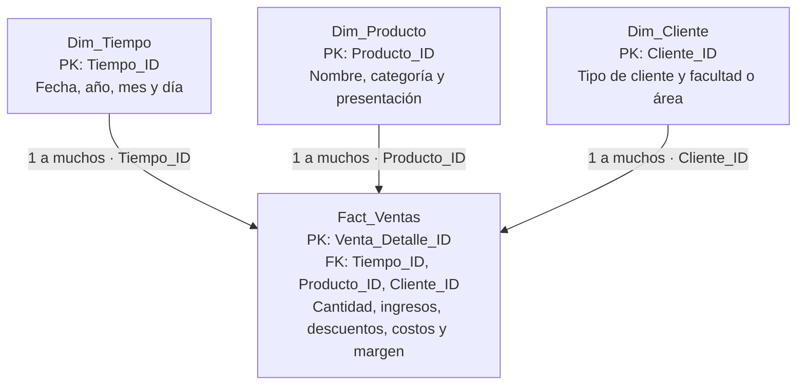

# Actividad calificable · Corte 1 — Diseño de un modelo estrella

**Semana 4 · Inteligencia de Negocios**  
**Proceso:** ventas de una cafetería universitaria.  
**Archivo de datos:** [Cafeteria_Universitaria_PowerBI.xlsx](Cafeteria_Universitaria_PowerBI.xlsx).

## 1. Proceso y pregunta de negocio

El proceso seleccionado es la venta de alimentos y bebidas en una cafetería universitaria. La cafetería atiende a estudiantes, docentes, personal administrativo y visitantes. Cada compra puede incluir varios productos, con su cantidad, precio y descuento.

**Pregunta de negocio:** ¿Qué ingresos netos genera la cafetería por producto, tipo de cliente y mes, y en qué meses alcanza la meta de $10.000.000 COP?

Este análisis permite identificar productos y segmentos con mayor contribución a los ingresos, reconocer periodos de baja demanda y evaluar promociones o ajustes en la oferta.

### KPI principal y meta

| Elemento               | Definición                                                                                                            |
| ---------------------- | --------------------------------------------------------------------------------------------------------------------- |
| KPI                    | Ingresos mensuales por ventas, después de descuentos.                                                                 |
| Cálculo                | Suma de `Fact_Ventas[Ingreso_Neto_COP]` para cada mes calendario.                                                     |
| Meta                   | Ingresos iguales o superiores a **$10.000.000 COP al mes**, para toda la cafetería.                                   |
| Cumplimiento           | Ingresos del mes / $10.000.000 × 100.                                                                                 |
| Frecuencia de revisión | Mensual.                                                                                                              |
| Acción si no se cumple | Revisar productos y tipos de cliente con menor demanda y plantear promociones, respetando el margen de los productos. |

“Ingreso neto” significa ingreso después de descuentos; no corresponde a utilidad neta. La meta es global y no está repartida entre productos o tipos de cliente.

## 2. Sistema de origen OLTP y análisis OLAP

El sistema de origen conceptual es el **punto de venta de la cafetería**, un sistema **OLTP (Online Transaction Processing)**. Su función es registrar operaciones individuales: una compra, sus productos, cantidades, precios, descuentos y pago. Prioriza transacciones rápidas y consistentes para atender la operación diaria.

El análisis se realiza en un entorno **OLAP (Online Analytical Processing)** o en un **Data Warehouse** porque necesita consultar datos históricos, sumar muchas ventas y comparar productos, clientes y periodos. Separar estas consultas del sistema de caja evita que el análisis de grandes volúmenes afecte la atención de compras.

Un proceso **ETL** extraería los registros de caja, validaría las claves y los tipos de datos, calcularía los importes y cargaría las dimensiones y los hechos. En esta práctica, el Excel representa el resultado preparado de esa carga: contiene datos sintéticos organizados para analizarlos en Power BI. No es una conexión a un punto de venta real ni un warehouse desplegado.

## 3. Diseño del modelo estrella

### Grano de la tabla de hechos

**Una fila de `Fact_Ventas` representa un producto dentro de una compra.** Si una compra incluye café y una empanada, se registran dos filas con el mismo `Venta_ID` y distintos `Venta_Detalle_ID` y `Linea_Numero`.

- **Clave primaria:** `Venta_Detalle_ID`, única por línea.
- **Identificador de compra:** `Venta_ID`, que puede repetirse. Es una dimensión degenerada almacenada en los hechos.
- **Clave alternativa:** la combinación `Venta_ID` + `Linea_Numero` es única.
- **Claves foráneas:** `Producto_ID`, `Cliente_ID` y `Tiempo_ID`.

### Medidas

Las medidas aditivas son `Cantidad`, `Importe_Bruto_COP`, `Descuento_COP`, `Ingreso_Neto_COP`, `Costo_Total_COP` y `Margen_Bruto_COP`. Se pueden sumar por producto, tipo de cliente o periodo.

El precio unitario, el costo unitario y el porcentaje de descuento no se deben sumar. El porcentaje de margen se calcula a partir de los totales de margen e ingresos, no sumando porcentajes por línea.

### Dimensiones y atributos

| Tabla          | Clave primaria | Atributos principales                                                           | Registros |
| -------------- | -------------- | ------------------------------------------------------------------------------- | ---------:|
| `Dim_Producto` | `Producto_ID`  | Código, nombre, categoría, presentación, precio de lista y costo de referencia. | 24        |
| `Dim_Cliente`  | `Cliente_ID`   | Código, nombre ficticio, tipo de cliente y facultad o área.                     | 400       |
| `Dim_Tiempo`   | `Tiempo_ID`    | Fecha, año, trimestre, semestre, mes, día, fin de semana y operación simulada.  | 365       |

### Diagrama del modelo estrella

### Relaciones

| Lado uno: dimensión         | Lado muchos: hechos        | Cardinalidad | Filtro                  |
| --------------------------- | -------------------------- | ------------ | ----------------------- |
| `Dim_Producto[Producto_ID]` | `Fact_Ventas[Producto_ID]` | 1 a muchos   | Dimensión hacia hechos. |
| `Dim_Cliente[Cliente_ID]`   | `Fact_Ventas[Cliente_ID]`  | 1 a muchos   | Dimensión hacia hechos. |
| `Dim_Tiempo[Tiempo_ID]`     | `Fact_Ventas[Tiempo_ID]`   | 1 a muchos   | Dimensión hacia hechos. |

Las tres relaciones deben estar activas y usar dirección de filtro única. Las dimensiones no se relacionan entre sí. Sus atributos están en la misma tabla dimensional, lo que mantiene la estructura de estrella.

## 4. Dos preguntas que responde el modelo

1. **¿Qué meses alcanzan la meta de ingresos netos de $10.000.000 COP?** Se responde agrupando `Ingreso_Neto_COP` por `Dim_Tiempo[Anio_Mes]` y comparándolo con la meta mensual.
2. **¿Qué categorías de producto generan más ingresos netos para cada tipo de cliente?** Se responde sumando `Ingreso_Neto_COP` por `Dim_Producto[Categoria]` y `Dim_Cliente[Tipo_Cliente]`.

## Model & questions

The selected business process is product sales at a university cafeteria. The fact table is `Fact_Ventas`. Each row represents one product line within a sales transaction. The primary key is `Venta_Detalle_ID`, while `Venta_ID` identifies the purchase and may appear on several rows. The additive measures include quantity, gross sales, discounts, net revenue, total cost and gross margin. The product, customer and time dimensions describe what was sold, who purchased it and when the sale occurred. Each dimension has a unique primary key linked to a foreign key in the fact table through a one-to-many relationship. The main KPI is monthly net revenue, with a target of COP 10,000,000. All records are synthetic and cover the 2025 calendar year.

1. Which months reach the monthly net revenue target of COP 10,000,000?
2. Which product categories generate the most net revenue for each customer type?

## 5. Datos de la práctica y reglas de cálculo

El Excel contiene únicamente las cuatro hojas `Fact_Ventas`, `Dim_Producto`, `Dim_Cliente` y `Dim_Tiempo`. Cada hoja tiene una tabla de Excel con el mismo nombre. La documentación y el diccionario están en este README.

- **Periodo:** 1 de enero a 31 de diciembre de 2025.
- **Volumen:** 26.547 líneas de venta correspondientes a 14.536 compras.
- **Origen:** datos totalmente sintéticos; no representan personas ni una cafetería real.
- **Moneda:** pesos colombianos (COP), guardados como valores numéricos.
- **Demanda:** menor actividad en enero, junio, julio y diciembre; sábados con jornada reducida y domingos sin ventas.
- **Cierres simulados:** del 1 al 6 de enero y del 21 al 31 de diciembre. El calendario no reproduce festivos oficiales.
- **Compras:** cada compra tiene un solo cliente, fecha, hora y medio de pago, con uno a tres productos distintos.
- **Descuentos:** algunas compras de estudiantes reciben 10% en todas sus líneas; las demás no reciben descuento.
- **Precios y costos:** constantes durante el periodo. No se incluyen devoluciones, propinas, impuestos desglosados ni gastos fijos. El margen bruto no equivale a utilidad neta.

| Importe por línea | Regla                                                        |
| ----------------- | ------------------------------------------------------------ |
| Importe bruto     | Cantidad × precio unitario.                                  |
| Descuento         | Importe bruto × porcentaje de descuento, redondeado al peso. |
| Ingreso neto      | Importe bruto − descuento.                                   |
| Costo total       | Cantidad × costo unitario.                                   |
| Margen bruto      | Ingreso neto − costo total.                                  |

Los importes están precalculados como una extracción ETL. Si se modifica una cantidad, precio, costo o porcentaje, se deben recalcular los importes de esa línea antes de actualizar Power BI.

## 6. Diccionario de datos

**PK** significa clave primaria: identifica una sola fila de la tabla. **FK** significa clave foránea: referencia una clave de una dimensión. Una **medida aditiva** puede sumarse. Los atributos describen, filtran o agrupan los hechos.

Los tipos indican cómo configurar cada campo en Power BI. “Entero COP” significa un importe numérico en pesos sin decimales; también puede usarse número decimal fijo. Los códigos se conservan como texto.

### Fact_Ventas

| Campo                  | Tipo en Power BI | Rol                  | Descripción y regla                                                |
| ---------------------- | ---------------- | -------------------- | ------------------------------------------------------------------ |
| `Venta_Detalle_ID`     | Entero           | PK                   | Identificador único de la línea. No sumar.                         |
| `Venta_ID`             | Texto            | Dimensión degenerada | Identificador de compra. Se repite entre líneas. Contar distintos. |
| `Linea_Numero`         | Entero           | Identificador        | Número de línea dentro de la compra, desde 1.                      |
| `Tiempo_ID`            | Entero           | FK                   | Referencia a Dim_Tiempo[Tiempo_ID]. No sumar.                      |
| `Producto_ID`          | Entero           | FK                   | Referencia a Dim_Producto[Producto_ID]. No sumar.                  |
| `Cliente_ID`           | Entero           | FK                   | Referencia a Dim_Cliente[Cliente_ID]. No sumar.                    |
| `Hora`                 | Entero           | Atributo             | Hora local de la compra, 0–23. No sumar.                           |
| `Minuto`               | Entero           | Atributo             | Minuto local de la compra, 0–59. No sumar.                         |
| `Medio_Pago`           | Texto            | Atributo             | Efectivo, Transferencia o Tarjeta. Único por compra.               |
| `Cantidad`             | Entero           | Medida aditiva       | Unidades del producto en la línea. Agregación: suma.               |
| `Precio_Unitario_COP`  | Entero COP       | Medida no aditiva    | Precio por unidad antes del descuento. No sumar.                   |
| `Costo_Unitario_COP`   | Entero COP       | Medida no aditiva    | Costo directo por unidad. No sumar.                                |
| `Descuento_Porcentaje` | Decimal          | Medida no aditiva    | 0 o 0,10. No sumar ni promediar sin ponderación.                   |
| `Importe_Bruto_COP`    | Entero COP       | Medida aditiva       | Cantidad × Precio_Unitario_COP. Sumar.                             |
| `Descuento_COP`        | Entero COP       | Medida aditiva       | ROUND(Importe_Bruto_COP × Descuento_Porcentaje, 0). Sumar.         |
| `Ingreso_Neto_COP`     | Entero COP       | Medida aditiva       | Importe_Bruto_COP − Descuento_COP. Base del KPI. Sumar.            |
| `Costo_Total_COP`      | Entero COP       | Medida aditiva       | Cantidad × Costo_Unitario_COP. Sumar.                              |
| `Margen_Bruto_COP`     | Entero COP       | Medida aditiva       | Ingreso_Neto_COP − Costo_Total_COP. Sumar.                         |

### Dim_Producto

| Campo                  | Tipo en Power BI | Rol      | Descripción y regla                          |
| ---------------------- | ---------------- | -------- | -------------------------------------------- |
| `Producto_ID`          | Entero           | PK       | Clave única del producto. No sumar.          |
| `Codigo_Producto`      | Texto            | Atributo | Código comercial ficticio.                   |
| `Nombre_Producto`      | Texto            | Atributo | Nombre del producto.                         |
| `Categoria`            | Texto            | Atributo | Familia de producto.                         |
| `Presentacion`         | Texto            | Atributo | Tamaño o unidad comercial.                   |
| `Precio_Lista_COP`     | Entero COP       | Atributo | Precio de lista constante en 2025. No sumar. |
| `Costo_Referencia_COP` | Entero COP       | Atributo | Costo unitario constante en 2025. No sumar.  |

### Dim_Cliente

| Campo             | Tipo en Power BI | Rol      | Descripción y regla                              |
| ----------------- | ---------------- | -------- | ------------------------------------------------ |
| `Cliente_ID`      | Entero           | PK       | Clave única del cliente ficticio.                |
| `Codigo_Cliente`  | Texto            | Atributo | Código ficticio sin datos personales.            |
| `Nombre_Ficticio` | Texto            | Atributo | Etiqueta ficticia para identificar clientes.     |
| `Tipo_Cliente`    | Texto            | Atributo | Estudiante, Docente, Administrativo o Visitante. |
| `Facultad_Area`   | Texto            | Atributo | Facultad académica, Administración o No aplica.  |

### Dim_Tiempo

| Campo                | Tipo en Power BI | Rol      | Descripción y regla                                                  |
| -------------------- | ---------------- | -------- | -------------------------------------------------------------------- |
| `Tiempo_ID`          | Entero           | PK       | Clave entera AAAAMMDD. Una fila por día.                             |
| `Fecha`              | Fecha            | Atributo | Fecha real de Excel sin hora, continua y única.                      |
| `Anio`               | Entero           | Atributo | Año calendario.                                                      |
| `Trimestre`          | Entero           | Atributo | Trimestre del año, 1–4.                                              |
| `Semestre`           | Entero           | Atributo | Semestre del año, 1–2.                                               |
| `Mes_Numero`         | Entero           | Atributo | Mes del año, 1–12. Ordena Mes_Nombre.                                |
| `Mes_Nombre`         | Texto            | Atributo | Nombre español del mes.                                              |
| `Anio_Mes`           | Texto            | Atributo | Etiqueta AAAA-MM para agrupar por mes y año.                         |
| `Anio_Mes_Orden`     | Entero           | Atributo | Clave AAAAMM para ordenar Anio_Mes.                                  |
| `Dia_Mes`            | Entero           | Atributo | Día del mes, 1–31.                                                   |
| `Dia_Semana_Numero`  | Entero           | Atributo | Lunes = 1; domingo = 7.                                              |
| `Dia_Semana_Nombre`  | Texto            | Atributo | Nombre español del día de semana.                                    |
| `Es_Fin_Semana`      | Booleano         | Atributo | Verdadero para sábado o domingo.                                     |
| `Operacion_Simulada` | Texto            | Atributo | Jornada regular, Jornada reducida o Cerrado. Supuesto del ejercicio. |
